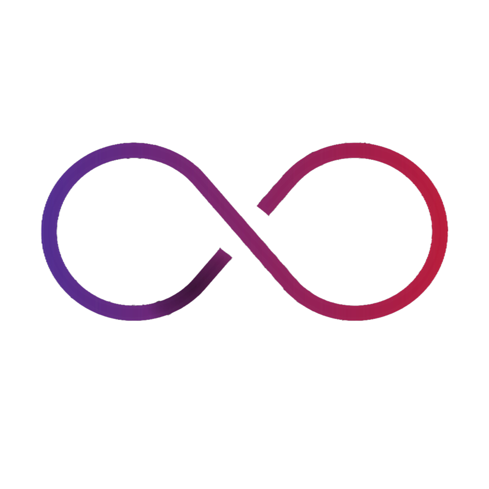

# Transilience AI

**Managed Cloud Security & Compliance — Operated by AI Agents**

---

## 🛡️ Who We Are

**Transilience AI** delivers **enterprise-grade cloud security and compliance** at a fraction of traditional cost, powered by autonomous AI agents. We replace fragmented tooling and manual workflows with a unified agent platform that continuously monitors, investigates, remediates, and audits cloud environments — 24/7.

> *"Enterprise Security for Your Enterprise Customers Without Enterprise Cost."*

Our AI agents autonomously complete use cases across:

| Agent Domain | What It Does |
|---|---|
| 🔍 **CSPM** | Detects misconfigurations, risky identities, and policy drift. Agents investigate context and recommend next actions — not just alerts. |
| 🎯 **CTEM** | Correlates app vulnerabilities with exploitability, auto-generates investigation summaries, and routes clear tickets to the right owner. |
| 🖥️ **CWPP** | Tracks workload risks with context-aware prioritization, automates remediation workflows, and keeps teams aligned. |
| ✅ **Compliance** | Automates evidence collection, maps findings to controls, and keeps posture current as cloud environments change. |

---

## 📊 Platform Impact

| 4 Agent Domains | 70% Less Manual Triage | 80% Less Audit Prep | 24/7 Monitoring |
|:---:|:---:|:---:|:---:|
| CSPM · CNAPP · CWPP · CTEM | Less manual security triage | Less audit evidence prep time | Continuous monitoring & execution |

---

## 🏗️ Framework Coverage

One platform across all major security and compliance frameworks:

`ISO 27001` &nbsp; `ISO 42001` &nbsp; `SOC 2 Type II` &nbsp; `GDPR` &nbsp; `PCI DSS` &nbsp; `CIS Controls` &nbsp; `CSA` &nbsp; `HIPAA`

---

## 🚀 Open Source Repositories

### 🔐 [communitytools](https://github.com/transilienceai/communitytools)

Open-source **Claude Code skills, agents, and slash commands** for AI-powered penetration testing, bug bounty hunting, and security research. 7 security skills, 35+ specialized agents running in parallel, covering 100% of OWASP Top 10 and 46+ attack types.

> 🏆 The autonomous pentesting agent from this repo holds **Pro Hacker rank on Hack The Box** — **top 2% globally**.

**Highlights:**
- 🤖 35+ specialized agents running autonomous security workflows in parallel
- 🎯 7 slash commands covering pentesting, bug bounty, CVE testing, and domain assessment
- 📊 100% OWASP Top 10 coverage with CVSS 3.1 scoring on all findings
- 📁 Structured output with executive summaries, evidence, and platform-ready reports

**[Explore the full repo &rarr;](https://github.com/transilienceai/communitytools)**

---

### ⚙️ [cldpm](https://github.com/transilienceai/cldpm)

**CPM (Claude Project Manager)** — an SDK and CLI for managing mono repos with multiple Claude Code projects. It solves the DRY problem for AI-assisted development: share skills, agents, hooks, and rules across projects without duplication.

**Highlights:**
- 🗂️ Manage multi-project mono repos with a single CLI
- 🔁 Share Claude Code skills and agents across all projects without copy-pasting
- 🪝 Centralize hooks and rules, propagate changes everywhere instantly
- 🛠️ SDK interface for programmatic integration into your own tooling

---

### 🎬 [transilience-communitytools-marketing](https://github.com/transilienceai/transilience-communitytools-marketing)

An **AI-powered content-to-video pipeline** that turns any content into professional marketing videos. Feed it images, documents, presentations, videos, or website URLs — it outputs cinematic, animated videos with voice cloning and AI-generated music.

**Highlights:**
- 🖼️ Accepts any content format: images, PDFs, decks, videos, or URLs
- 🎙️ Voice cloning for consistent brand narration
- 🎵 AI music generation tailored to each video's tone
- 🎞️ Cinematic animation engine for polished, professional output

---

## 🌐 Platform & Products

| Product | Link |
|---|---|
| Security OS | [app.transilience.cloud](https://app.transilience.cloud/) |
| Demoforge (AI Video Generator) | [demoforge.transilience.cloud](https://demoforge.transilience.cloud/) |

---

## 💬 What Customers Say

> *"Thanks to Transilience, we got SOC2 certified without hiring any security staff. Their AI agents monitored, collected evidence, and proactively alerted us."*
> — **Vincent Atallah**, President, Aucctus

> *"The GRC automation delivered by Transilience allows my team to do 10x more work than we used to previously."*
> — **Udit Pathak**, VP GRC, Network Intelligence

> *"Using Transilience was a game-changer in our journey toward achieving PCI compliance."*
> — **Jeff Go**, World Xchange

---

**Built with ❤️ by the Transilience AI team**

[Website](https://www.transilience.ai) &nbsp;·&nbsp; [Blog](https://www.transilience.ai/blog) &nbsp;·&nbsp; [Careers](https://www.transilience.ai/careers) &nbsp;·&nbsp; [Contact](https://www.transilience.ai/contact-us)

